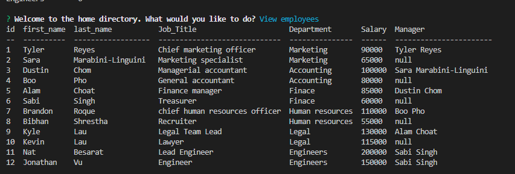

# Employee_Tracker

## Description 
This app uses MySQL to create tables that have foreign keys to connect the tables to each other. Once the MySQL documents have been SOURCE then you would have created a database that contains information for each table. When the database is created then you are ready to run the app. In this app you have multiple options you can choose from. The options are to view departments, employees, or roles. The other options are to change the data in the tables. You can add departments, roles, and employees, as well as update the current employees. This is all ran using node js to call the javascript file.

## User Story 
AS A business owner 
I WANT to be able to view and manage the departments, roles, and employees in my company 
SO THAT I can organize and plan my business 

## Acceptance Criteria
GIVEN a command-line application that accepts user input 
WHEN I start the application 
THEN I am presented with the following options: view all departments, view all roles, view all employees, add a department, add a role, add an employee, and update an employee role 
WHEN I choose to view all departments 
THEN I am presented with a formatted table showing department names and department ids 
WHEN I choose to view all roles 
THEN I am presented with the job title, role id, the department that role belongs to, and the salary for that role 
WHEN I choose to view all employees 
THEN I am presented with a formatted table showing employee data, including employee ids, first names, last names, job titles, departments, salaries, and managers that the employees report to 
WHEN I choose to add a department 
THEN I am prompted to enter the name of the department and that department is added to the database 
WHEN I choose to add a role 
THEN I am prompted to enter the name, salary, and department for the role and that role is added to the database 
WHEN I choose to add an employee 
THEN I am prompted to enter the employee’s first name, last name, role, and manager, and that employee is added to the database 
WHEN I choose to update an employee role 
THEN I am prompted to select an employee to update and their new role and this information is updated in the database 

## Installation 
* npm init -y 
* npm i
* npm install mysql2
* npm install inquirer
* npm install console.table --save

## Usage 
Installing mysql2 is needed to grab the information from MySQL to bring over to your js files. Inquirer is used to getting the command prompts in your console log. "Console.table" is just used for styling your data tables for a cleaner look. These are all the packages that are needed to run this app. You would also need to SOURCE  the SQL documents to create the data table and generate the preset data for the tables. Once you have done all that just run "node index.js" there will have all the options from inquirer.

## ScreenShot 
Data Table 

## Link
https://www.youtube.com/watch?v=GiLdrUKnnlE&t=5s 

## Questions 
Message me at these links for further questions.

https://github.com/Jonnvoo 
Jonathanvu2065@gmail.com